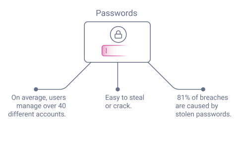
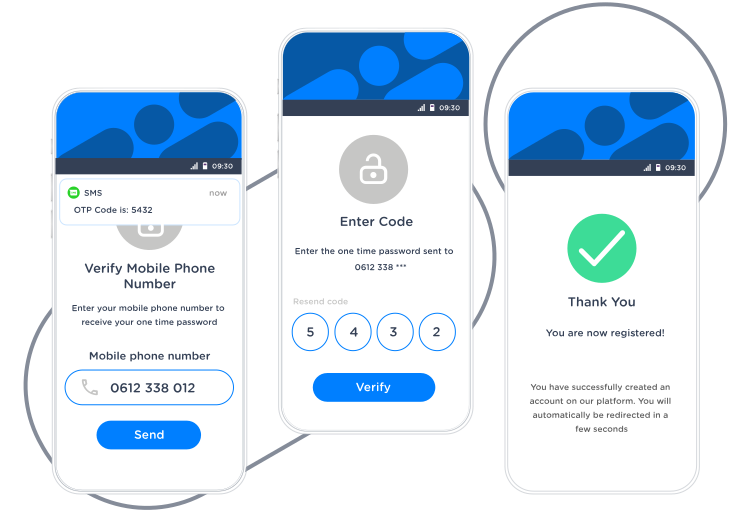
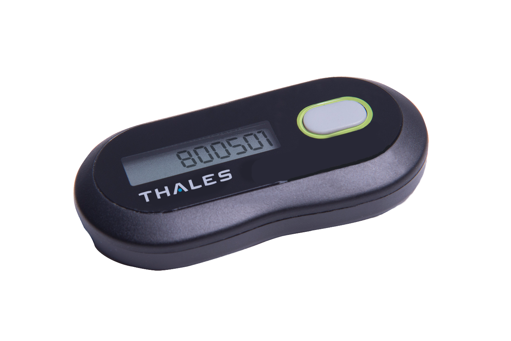
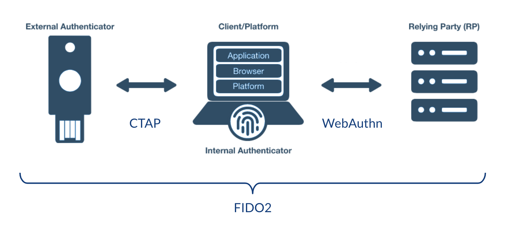

---

---

<!-- _footer: source: https://curity.io/resources/learn/webauthn-overview/ -->

---

Password managers

---

Multi-factor Authentication (MFA)

- Something you know
- Something you have
- Something you are 

---

# One-Time Password (OTP)

---

# ... are now fairly common

- devices:
    - Key fob / Smartcard
    - Phone
        - via SMS
        - via App

- variants:
    - Time-Based One-Time Password (TOTP)
    - HMAC-Based One-Time Password (HOTP)

---

# ... but have risks as well

- SIM swap attack
- Phishing

---

Example of phishing attack with OTP

--- 

# Fast Identity Online (FIDO) Alliance

*allow organizations to implement **passwordless** login capabilities **with or without MFA***

- W3C
- Google, Microsoft, IBM, Paypal, ...  

---

FIDO U2F(CTAP1) --> FIDO UAF --> FIDO2 (CTAP2 + WebAuthn)

- Universal 2nd Factor (U2F) = Client-to-Authenticator-Protocol v1 (CTAP1)
- Univeral Authentication Framework (UAF)

FIDO2 truly allows passworldless login, whereas U2F/UAF was meant for MFA.

---

---

Yubikey

<https://github.com/Yubico/python-fido2>
<https://github.com/duo-labs/py_webauthn>

---

How does FIDO solve

- Database breaches?
    - The credentials never leave the device. The server only stores the public key. 
- Fishing?
    - The key is linked to a hostname. 
- Man-in-the-Middle-Attacks (MITM)? 
    - 

---

Platform vs. Roaming authenticators

---

What if my authenticator gets stolen?

=> That's why U2F authenticators (which generally require just a tap) are not a good idea for first-factor authentication.
=> Using multiple keys is usually a good idea
=> You can setup fall-back mechanisms for when the authenticator is lost (OTP, push-notification, etc.)

[SO question](https://security.stackexchange.com/questions/103474/why-is-u2f-not-good-enough-to-be-used-as-authentication)

---

Will WebAuthn passkeys replace password managers? 

---

Websites already supporting Fido(2)

GitHub: FIDO U2F

- <https://github.blog/2015-10-01-github-supports-universal-2nd-factor-authentication/>
- <https://github.blog/2021-05-10-security-keys-supported-ssh-git-operations/>

---

WebAuthn vs OAuth2 / OpenID Connect?

---

Sources:

- <https://developers.google.com/identity/fido>
- [Everything You Want to Know About WebAuthn (YouTube)](https://www.youtube.com/watch?v=mjHIt9lDBgA)
- [Getting Started with WebAuthn (YouTube)](https://www.youtube.com/watch?v=yccBhpdJjJc&t=2s)

- [How FIDO2 and WebAuthn Stop Account Takeovers (YouTube)](https://www.youtube.com/watch?v=aMo4ZlWznao&t=21s)

- [Does WebAuthn Signal the End of Passwords for Browsers (YouTube)](https://www.youtube.com/watch?v=S_Yxt3KJKYE)

- [Yubikey key generation](https://developers.yubico.com/U2F/Protocol_details/Key_generation.html)

